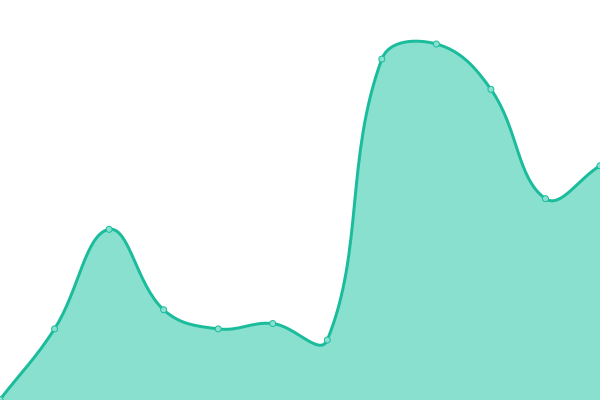
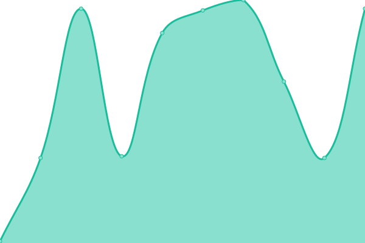

# [📈 Live Status](https://HakaiInstitute.github.io/upptime-trial): <!--live status--> **🟩 All systems operational**

This repository contains the open-source uptime monitor and status page for [Hakai Institute](http://hakai.org), powered by [Upptime](https://github.com/upptime/upptime).

With [Upptime](https://upptime.js.org), you can get your own unlimited and free uptime monitor and status page, powered entirely by a GitHub repository. We use [Issues](https://github.com/HakaiInstitute/upptime-trial/issues) as incident reports, [Actions](https://github.com/HakaiInstitute/upptime-trial/actions) as uptime monitors, and [Pages](https://HakaiInstitute.github.io/upptime-trial) for the status page.

<!--start: status pages-->
<!-- This summary is generated by Upptime (https://github.com/upptime/upptime) -->
<!-- Do not edit this manually, your changes will be overwritten -->
<!-- prettier-ignore -->
| URL | Status | History | Response Time | Uptime |
| --- | ------ | ------- | ------------- | ------ |
|  [Hakai.org Homepage](https://hakai.org/) | 🟩 Up | [hakai-org-homepage.yml](https://github.com/HakaiInstitute/upptime-trial/commits/HEAD/history/hakai-org-homepage.yml) | 

 346ms
     
 | 

<a href="https://HakaiInstitute.github.io/upptime-trial/history/hakai-org-homepage">99.92%</a>
    

|  [Hakai.org Wordpress Login Page](https://hakai.org/hakaiinstitutelogin/") | 🟩 Up | [hakai-org-wordpress-login-page.yml](https://github.com/HakaiInstitute/upptime-trial/commits/HEAD/history/hakai-org-wordpress-login-page.yml) | 

 200ms
     
 | 

<a href="https://HakaiInstitute.github.io/upptime-trial/history/hakai-org-wordpress-login-page">99.92%</a>
    

|  [Cloudways Hakai Magazine Homepage](https://www.hakaimagazine.com/) | 🟩 Up | [cloudways-hakai-magazine-homepage.yml](https://github.com/HakaiInstitute/upptime-trial/commits/HEAD/history/cloudways-hakai-magazine-homepage.yml) | 

 622ms
     
 | 

<a href="https://HakaiInstitute.github.io/upptime-trial/history/cloudways-hakai-magazine-homepage">99.82%</a>
    

|  [Cloudways Hakai Magazine Wordpress Login Page](https://www.hakaimagazine.com/hakaimagazinelogin/) | 🟩 Up | [cloudways-hakai-magazine-wordpress-login-page.yml](https://github.com/HakaiInstitute/upptime-trial/commits/HEAD/history/cloudways-hakai-magazine-wordpress-login-page.yml) | 

 108ms
     
 | 

<a href="https://HakaiInstitute.github.io/upptime-trial/history/cloudways-hakai-magazine-wordpress-login-page">99.83%</a>
    

<!--end: status pages-->

[**Visit our status website →**](https://HakaiInstitute.github.io/upptime-trial)

## 📄 License

- Powered by: [Upptime](https://github.com/upptime/upptime)
- Code: [MIT](./LICENSE) © [Hakai Institute](http://hakai.org)
- Data in the `./history` directory: [Open Database License](https://opendatacommons.org/licenses/odbl/1-0/)
